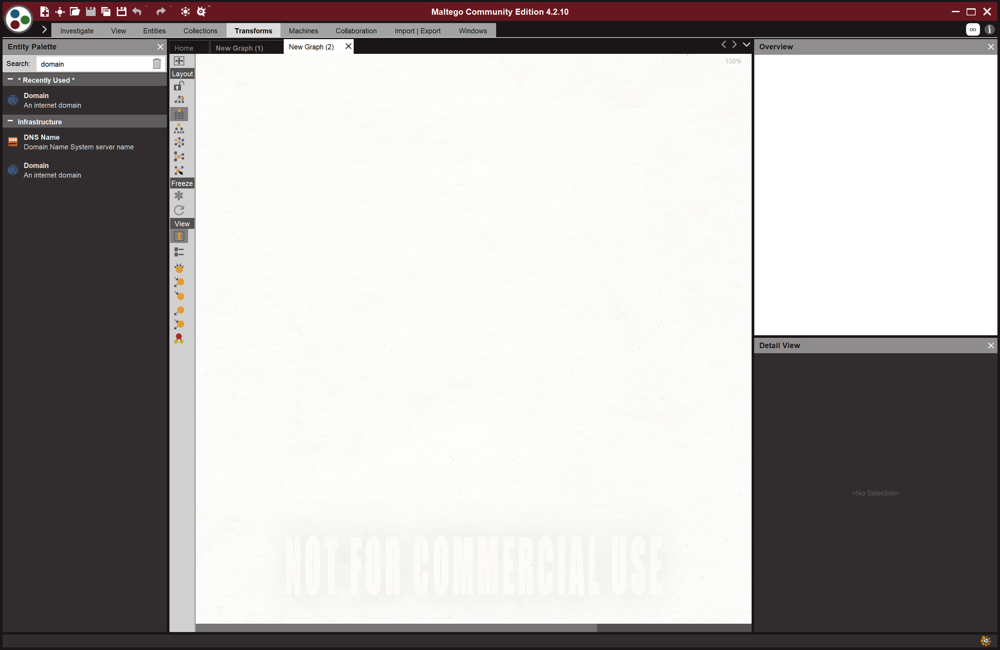
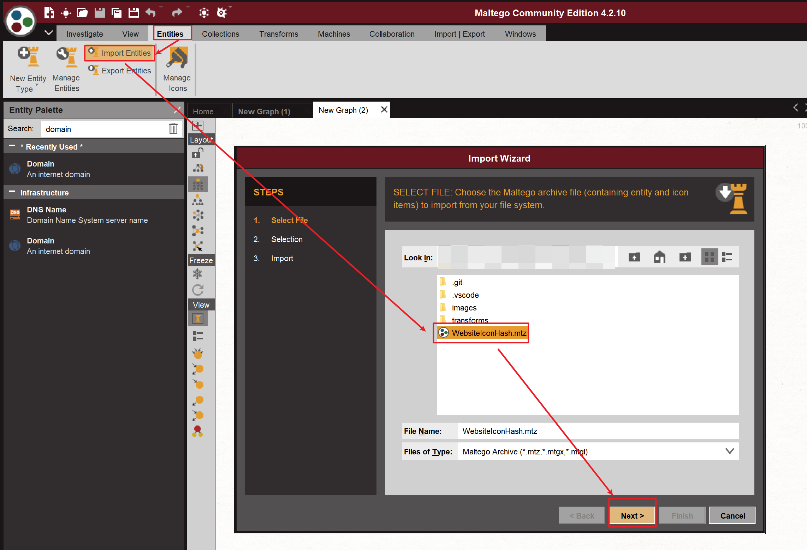
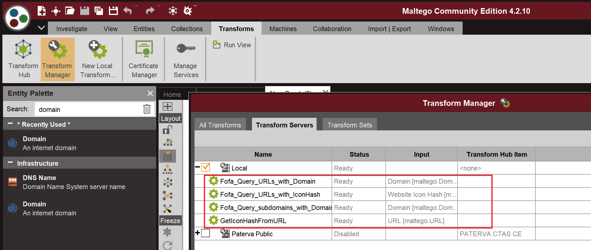
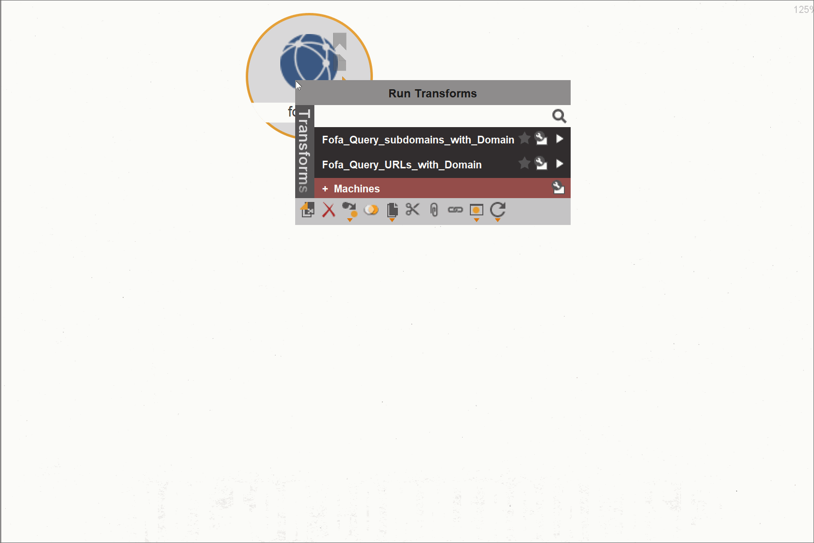

# Maltego_with_Fofa

整合fofa.so在Maltego里面，详细的文章会在nosec上提交。

## 使用指南
### 设置环境变量
需要设置如下两个环境变量,分别是fofa的邮箱和token，用于FOFA的API查询。
**建议用户等级为高级会员。**

```python
    fofa_email = getenv("fofa_email")
    fofa_token = getenv("fofa_token")
```

### 安装Maltego
这一步可以自行搜索，大致内容为下载maltego（版本为社区版），注册账号，登录。
然后新建一个图，完成后之后效果大致如下图，建议学习大致怎么使用：


### 下载本脚本

下载本脚本，存在电脑某一路径上
```git clone https://github.com/mark0smith/Maltego_with_Fofa.git ```

### Maltego 导入新建的Entry类型


第2步勾选就好了

### 添加本地脚本 Local Transfer
建议参考[官方的教程](https://docs.maltego.com/support/solutions/articles/15000017605-local-transforms-example-#adding-the-transform-to-maltego-0-6)

一共需要添加4次，完成后查看效果如下：



### 效果展示
